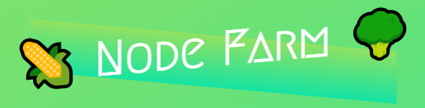
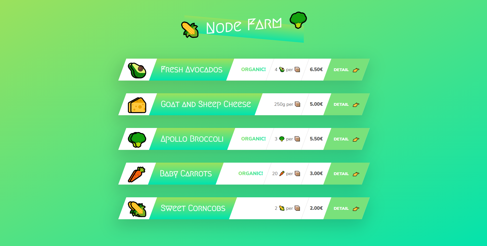
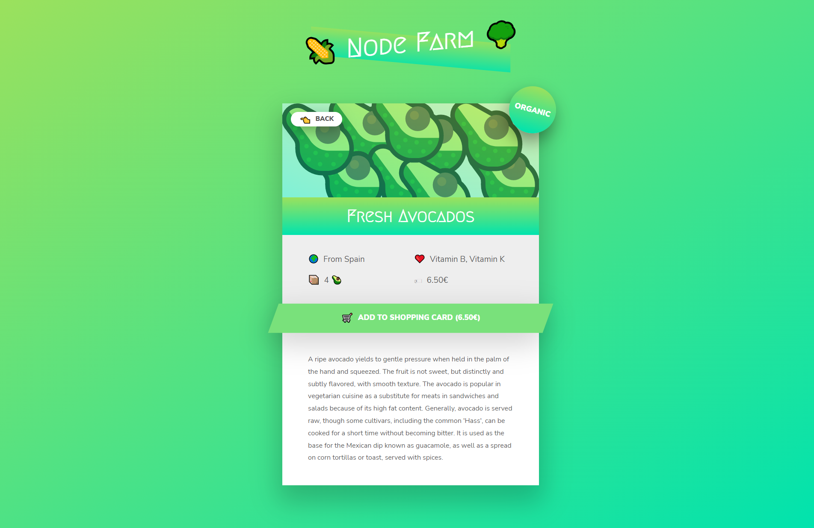

<h1 align="center">
    
</h1>

Esse projeto consiste em uma aplicação simples de exibição de dados vindos de uma API para entender os conceitos básicos do NodeJS.

## 🛠️ Construído com

Esse projeto foi desenvolvido com as seguintes tecnologias:

- [NodeJS](https://nodejs.org/en/)

### 📋 Pré-requisitos

Para clonar e rodar essa aplicação, será necessário o [Git](https://git-scm.com) e o [Node.js](https://nodejs.org/en/) instalados no seu computador.

### 🔧 Como usar

```bash
# Clone este repositório
$ git clone https://github.com/guispati/node-farm.git

# Abra a pasta criada
$ cd node-farm

# Instale as dependências
$ npm install

# Inicie o projeto
$ npm run start
```

## 💻 Demonstração

Na tela inicial é listada uma lista de produtos obtidos consumindo uma rota de API.


Ao clicar para visualizar os detalhes do produto, você será redirecionado para outra rota onde será exibido os dados daquele produto utilizando os dados da API.


## 📄 Licença

Este projeto está sob a licença MIT - veja o arquivo [LICENSE.md](LICENSE.md) para mais detalhes.

---
⌨️ com ❤️ por [Guilherme Spati](https://github.com/guispati) 😊